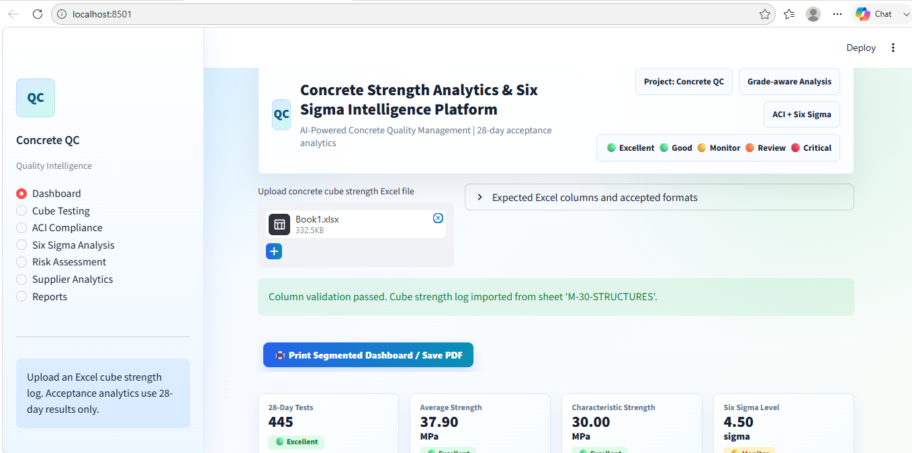

#  Concrete Strength Analytics & Six Sigma Intelligence Platform

An enterprise-grade analytics platform for Concrete Cube Compressive Strength Evaluation, ACI Acceptance Verification, and Six Sigma Quality Intelligence.

---

## 📊 Overview

The Concrete Strength Analytics & Six Sigma Intelligence Platform enables quality engineers, construction managers, QA/QC professionals, consultants, and project leadership teams to evaluate concrete strength performance using:

- ACI-style acceptance criteria
- Six Sigma process capability analysis
- Statistical quality control
- Risk intelligence analytics
- Supplier and mix performance benchmarking
- Executive dashboards and reporting

---

# 🖥️ Software Screenshots

## Excel Upload & Validation Screen

Upload concrete cube strength logs directly from Excel. The platform automatically validates columns, identifies accepted formats, and prepares data for analytics.



---

## Executive Analytics Dashboard – Page 1

The executive dashboard provides real-time KPIs, strength trend analysis, Six Sigma capability assessment, ACI compliance monitoring, supplier benchmarking, and management-level quality intelligence.


---

## Executive Analytics Dashboard – Page 2

Advanced risk analytics including abnormality detection, process capability monitoring, opportunity identification, outlier tracking, and predictive quality insights.


---

## ✨ Features

### 📁 Data Management

- Excel file upload
- Automatic column mapping and validation
- Data preview and cleansing
- Support for standard concrete cube strength logs
- Handles formatted cube testing registers

### 🏗️ Concrete Strength Analytics

- Cube strength calculation
- Test average strength evaluation
- Characteristic strength determination
- 28-day strength filtering
- Grade-aware analysis (M20, M25, M30, M35, M40, etc.)
- Supplier-wise performance review
- Structure-wise quality tracking

### ✅ ACI Compliance Verification

The dashboard evaluates concrete acceptance using ACI-style criteria:

#### Rule 1

Moving average of any 3 consecutive strength tests shall be:

    ≥ Specified Strength (f'c)

#### Rule 2

For:

    f'c ≤ 35 MPa

No individual test average shall fall below:

    f'c − 3.5 MPa

#### Rule 3

For:

    f'c > 35 MPa

No individual test average shall fall below:

    0.90 × f'c

The system automatically identifies non-compliance and highlights risk areas.

---

## 🎯 Six Sigma Quality Intelligence

The platform calculates:

- Mean
- Standard Deviation
- Coefficient of Variation (CV)
- Cp
- Cpk
- Sigma Level
- Defect Percentage
- Process Capability

---

## 🚦 Risk Intelligence Engine

### Green

- Fully compliant
- Stable process
- Low variation

### Amber

- Trend concern
- Marginal capability
- Requires monitoring

### Red

- Non-compliant
- High variation
- Immediate action required

---

## 🔍 Abnormality Detection

Automatically detects:

- Statistical outliers
- Sudden strength drops
- Repeated low-strength trends
- Excessive variation
- Process instability
- Potential quality risks

---

## 🌟 Positive Opportunity Analytics

The system identifies:

- Best-performing supplier
- Best mix design
- Strongest concrete grade
- Most consistent structure
- High-performing project zones
- Process improvement opportunities

---

## 📈 Interactive Dashboards

Built using Plotly interactive visualizations.

- Strength Trend Analysis
- Control Charts
- Histograms
- Supplier Performance
- Mix Design Performance
- Risk Intelligence Analytics
- Executive KPI Monitoring

---

## 📤 Export & Reporting

Generate:

- Excel analysis reports
- Compliance summaries
- Quality intelligence reports
- Executive dashboards
- Printable PDF-ready reports

---

## 🛠️ Technology Stack

- Python
- Streamlit
- Pandas
- NumPy
- Plotly
- OpenPyXL

---

## 🚀 Run Application

```bash
pip install -r requirements.txt
streamlit run app.py
```

Open:

```text
http://localhost:8501
```

---

*Designed and developed as an engineering analytics platform for digital construction quality management, Six Sigma process improvement, and data-driven decision support.*
## 🏆 Built for Data-Driven Construction Quality Excellence

Transform concrete test data into actionable quality intelligence through ACI compliance analytics, Six Sigma methodology, and AI-powered engineering insights.

---
## 👩‍💻 Developer

### Janice Benita F

B.Tech Information Technology (Student)

Specializing in:

- Machine Learning
- Computer Vision
- Explainable AI (XAI)
- Data Analytics
- Quality Intelligence Systems

### Related Projects

- Explainable Endodontic AI for Root Canal Prediction (EndoXAI)
- AI-Powered Concrete Crack Detection using Explainable AI (Grad-CAM)
- Concrete Strength Analytics & Six Sigma Intelligence Platform

### Connect

- GitHub: https://github.com/Janicebenita
- LinkedIn: https://linkedin.com/in/janice13

---
