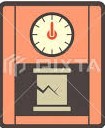
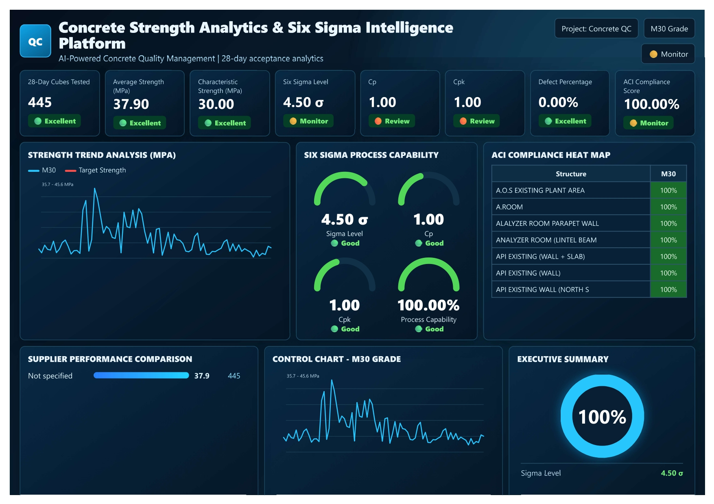
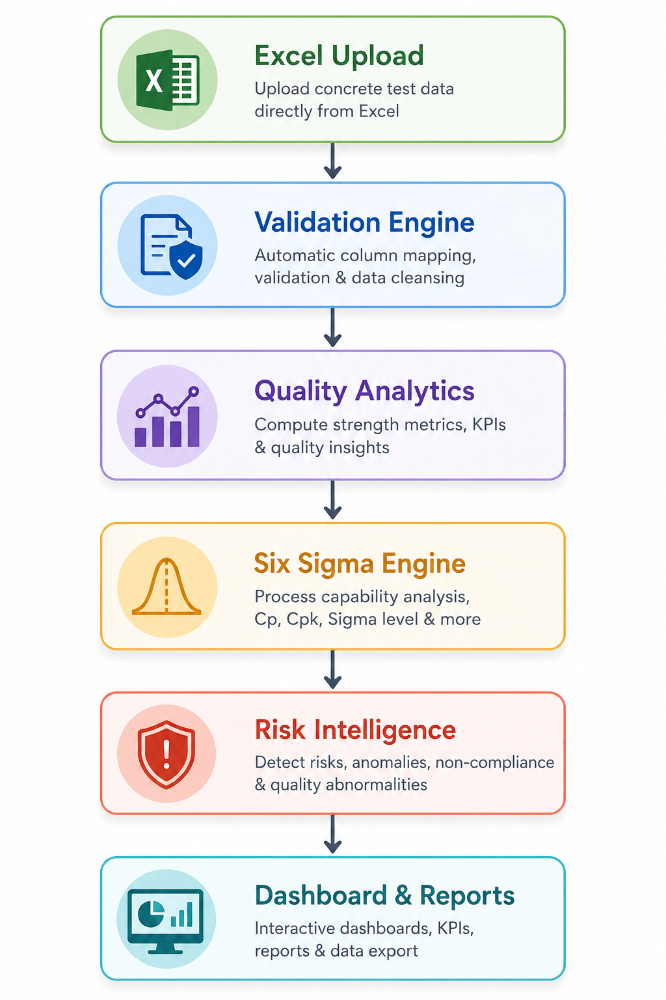
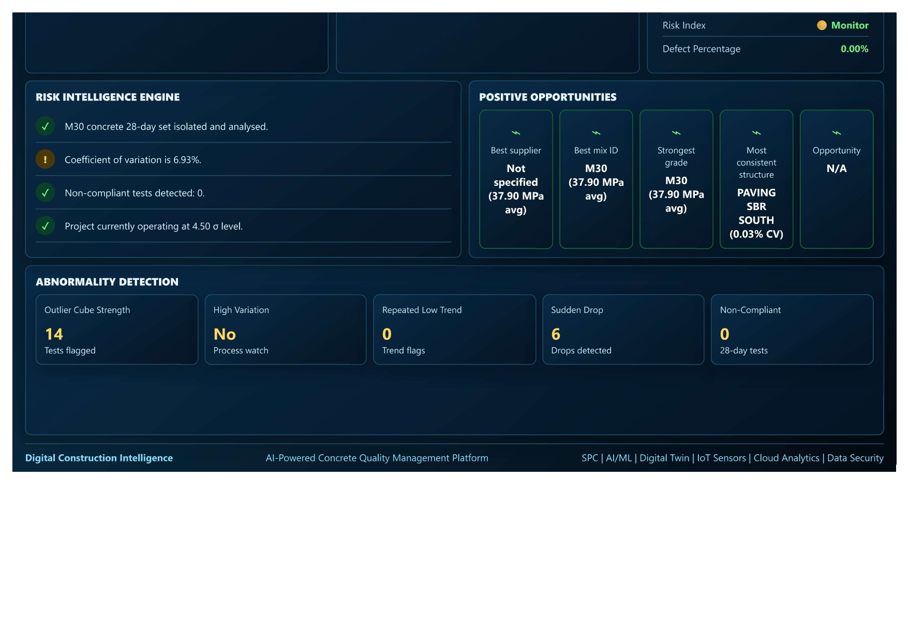

#  Concrete Strength Analytics & Six Sigma Intelligence Platform

### 📊 AI-Powered Construction Quality Intelligence for Concrete Strength Evaluation, ACI Compliance & Six Sigma Analytics

<p align="center">

</p>


### 🚀 Built With

<p align="center">


</p>


## 🎥 Platform Walkthrough

▶ **Watch Demo Video**

https://www.linkedin.com/posts/janice13_demo-file-for-concrete-strength-analytics-ugcPost-7471777343473332225-JoWa/

---

## 📌 Project Overview

Most construction projects evaluate concrete quality based on whether cube strength meets the specified grade.

However, passing strength alone does not guarantee process stability, consistency, or quality excellence.

This platform transforms routine concrete cube testing data into actionable engineering intelligence by combining:

✅ Concrete Strength Analytics

✅ ACI Acceptance Verification

✅ Six Sigma Process Capability Analysis

✅ Statistical Quality Control

✅ Risk Intelligence & Anomaly Detection

✅ Executive Quality Dashboards

The result is a data-driven quality intelligence system that helps engineers identify hidden risks, monitor process capability, and make informed quality decisions before issues impact construction performance.

---

## 🎯 Why This Platform?

In many construction projects, concrete quality evaluation stops once the cube strength meets the specified grade.

However, passing strength alone does not always indicate a stable and capable production process.

Hidden risks such as:

- High variation in concrete strength
- Process instability
- Supplier inconsistency
- Gradual quality deterioration
- Statistical non-conformance

often remain unnoticed until they impact project quality.

This platform transforms routine cube testing data into actionable engineering intelligence, enabling proactive quality management and data-driven decision making.

---

## 📊 Key Capabilities

### 🏗️ Concrete Strength Analytics

- Concrete strength evaluation
- Characteristic strength analysis
- Grade-wise performance monitoring
- Structure-wise quality assessment
- Supplier benchmarking
- Mix design performance evaluation

### 🎯 Six Sigma Quality Intelligence

- Sigma Level Calculation
- Cp (Process Capability)
- Cpk (Process Performance)
- Coefficient of Variation (CV)
- Defect Percentage Analysis
- Process Stability Monitoring

### ✅ ACI Compliance Verification

Automatically evaluates concrete acceptance using ACI-style acceptance criteria and highlights non-compliance risks.

### ⚠️ Risk Intelligence Engine

Automatically detects:

- Statistical outliers
- Sudden strength drops
- Abnormal quality trends
- Process instability
- Potential non-compliance risks

### 📈 Executive Decision Support

Provides management-ready dashboards for:

- QA/QC Teams
- Construction Managers
- Consultants
- Corporate Quality Teams
- Project Leadership

---

## 💼 Business Impact

### Traditional Approach

❌ Manual Excel Analysis

❌ Time-Consuming Interpretation

❌ Delayed Risk Detection

❌ Limited Statistical Insights

❌ Dependence on Individual Expertise

### Platform Approach

✅ Automated Quality Intelligence

✅ Instant Six Sigma Analysis

✅ Automated ACI Verification

✅ Early Risk Identification

✅ Executive-Level Decision Support

✅ Data-Driven Quality Management

---

## 🏗️ System Architecture

The platform follows a structured analytics workflow:

**Excel Upload → Validation Engine → Quality Analytics → Six Sigma Evaluation → Risk Intelligence → Executive Dashboards**

This transforms raw concrete test records into actionable quality intelligence within seconds.

### Architecture Diagram



---

## 🖥️ Platform Screenshots

### Dashboard Page 1 – Executive Quality Intelligence


### Dashboard Page 2 – Risk Intelligence & Opportunity Analytics



---

## ✨ Features

### 📁 Data Management

- Excel Upload
- Automatic Validation
- Data Cleansing
- Column Mapping
- Quality Checks

### 📊 Engineering Analytics

- Strength Trends
- Characteristic Strength
- Supplier Performance
- Structure Performance
- Mix Design Analysis

### 📈 Six Sigma Monitoring

- Sigma Level
- Cp
- Cpk
- Process Capability
- Variation Analysis

### 🚦 Risk Intelligence

- Outlier Detection
- Process Instability Monitoring
- Quality Risk Classification
- Non-Conformance Detection

### 📤 Reporting

- Executive Dashboards
- Quality Intelligence Reports
- Compliance Summaries
- Exportable Analytics

---

## 🎯 Future Vision

The long-term vision is to evolve this platform into a comprehensive **Construction Quality Intelligence System** featuring:

- Predictive Strength Forecasting
- AI-Based Quality Recommendations
- Supplier Risk Scoring
- SPC Automation
- Digital Twin Integration
- Enterprise Construction Intelligence

---

## 🛠️ Technology Stack

- Python
- Streamlit
- Pandas
- NumPy
- Plotly
- OpenPyXL

---

## 🚀 Run the Application

```bash
pip install -r requirements.txt
streamlit run app.py
```

Open:


## 🌐 Live Application

Try the platform directly in your browser:

👉 **[Launch Interactive Dashboard](https://huggingface.co/spaces/janicecodes/Concrete_strength_analysis_and_6_sigma_intelligence)**

No installation required.

---

## 🚀 Run the Application Locally

```bash
pip install -r requirements.txt
streamlit run app.py
```

Open locally:

```text
http://localhost:8501
```

---

## 👩‍💻 Developed By

### Janice Benita F

**B.Tech Information Technology**

Areas of Interest:

- Artificial Intelligence
- Computer Vision
- Explainable AI (XAI)
- Data Analytics
- Construction Quality Intelligence
- Industrial AI Applications

---

## 🌟 Related Projects

- 🏥 EndoXAI – Explainable AI for Root Canal Treatment Prediction
- 🏗️ AI-Powered Concrete Crack Detection System with Explainable AI
- 📊 Concrete Strength Analytics & Six Sigma Intelligence Platform

---

## 🤝 Feedback & Collaboration

Construction professionals, QA/QC engineers, Six Sigma practitioners, and data analytics experts are invited to explore the platform and provide feedback.

Your suggestions will help shape future versions of the system and contribute to smarter construction quality management solutions.

---

### 🏆 Built for Data-Driven Construction Quality Excellence

Transforming concrete test data into engineering intelligence through analytics, Six Sigma methodology, and AI-driven decision support.

---

## 🔗 Connect

- GitHub: https://github.com/Janicebenita
- LinkedIn: https://linkedin.com/in/janice13

## 📜 License

This project is licensed under the MIT License.

See the LICENSE file for details.
